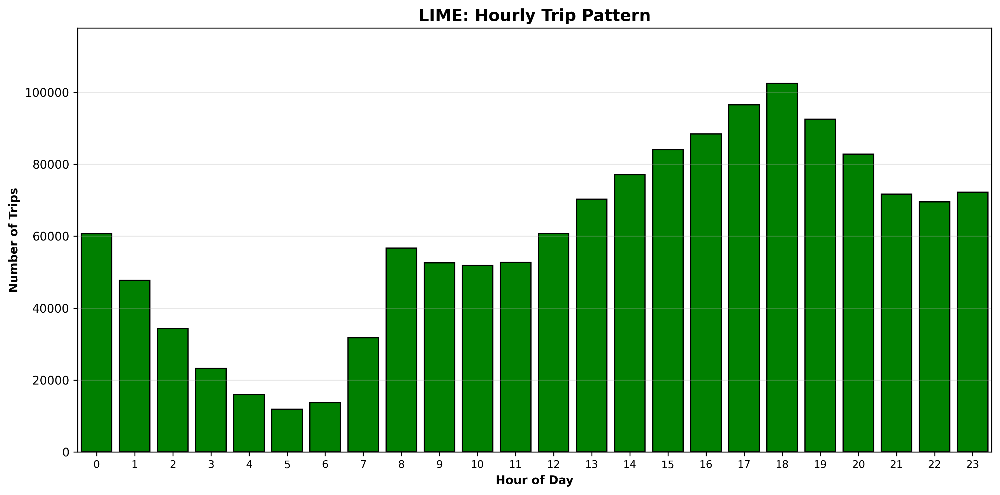
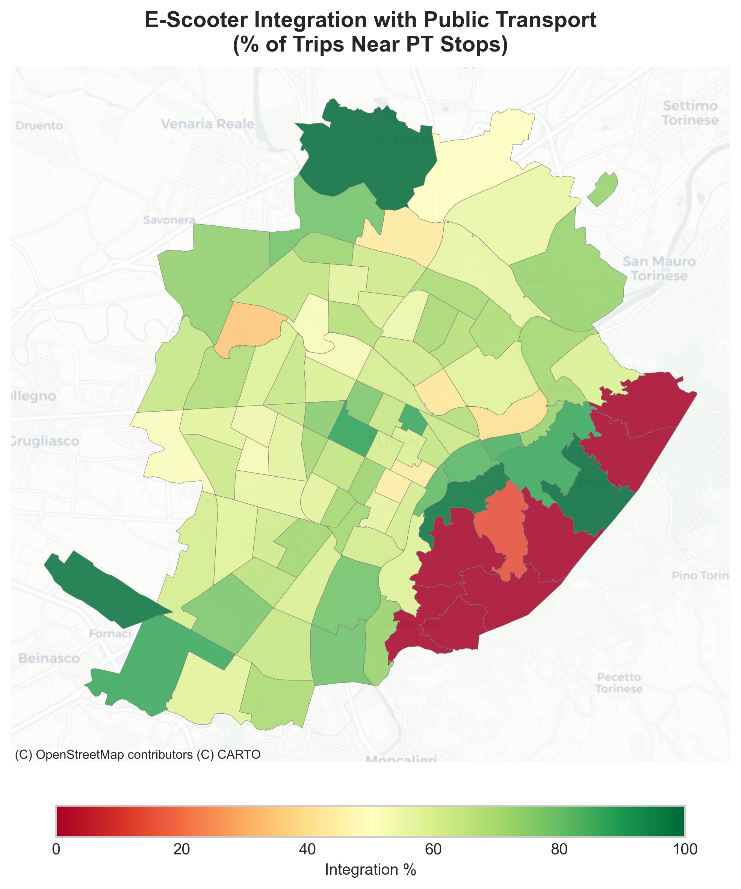
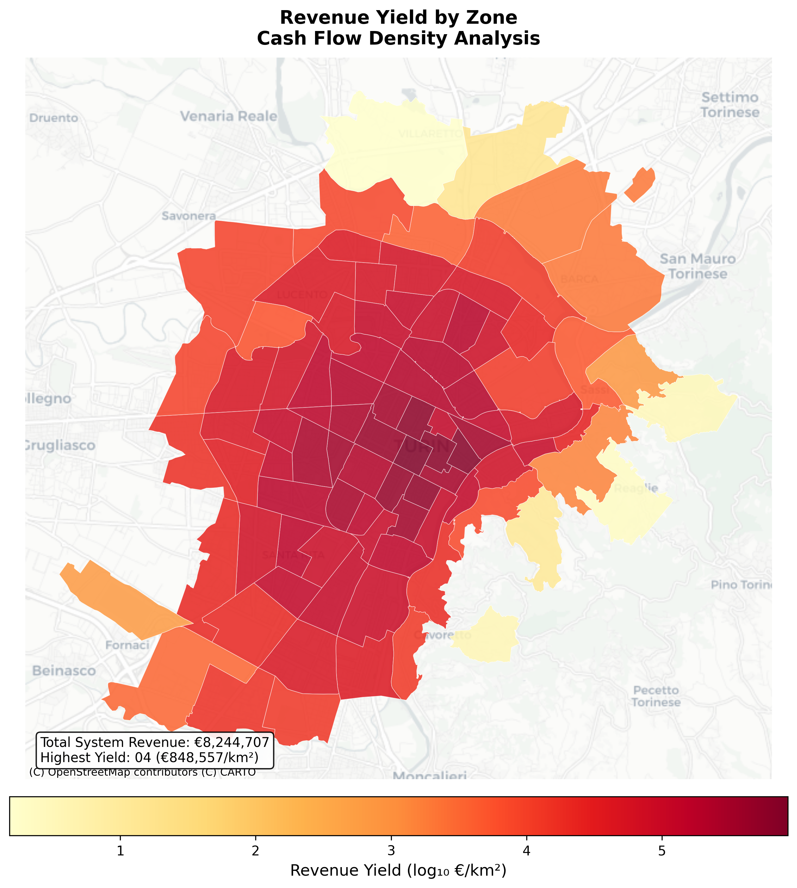

# Turin Micromobility Analysis

**A Snapshot Analysis of E-Scooter Sharing Services in Turin, Italy**

[](https://python.org)
[](https://geopandas.org)
[](#license)

*Politecnico di Torino | Transport Engineering | 2024-2025*

---

## Overview

This project analyzes and compares the service level, availability, and cost of three major micro-mobility operators (Lime, Bird, Voi) in Turin, Italy. Using a snapshot methodology, we capture the state of shared e-scooter systems at specific moments to evaluate fleet density, market share, battery levels, and pricing structures.

### Research Question

> Which operator offers the best service and value for money for a Home-to-University commute?

### Key Findings

| Metric | Value |
|--------|-------|
| Total Trips Analyzed | 549,513 |
| Integration Index (200m) | 95.3% |
| Feeder Rate | 82.4% |
| Peak Hour Concentration | 38.5% |

**Conclusion**: E-scooters function primarily as first/last-mile connectors to public transport rather than direct competitors.

---

## Methodology

### Study Area

- **Location**: Turin city center (approximately 1 km² around Politecnico di Torino campus)
- **Operators Analyzed**: Lime, Bird, Voi
- **Commute Route**: Codegone to Castello del Valentino (3.6 km)

### Snapshot Analysis Approach

1. **Define Study Area**: Select a zone where all three operators are active
2. **Data Collection**: Capture vehicle locations, battery levels, and pricing from mobile apps
3. **Calculate KPIs**: Fleet density, market share, average battery level, pricing
4. **Apply to Commute**: Calculate trip costs for each operator

### Key Performance Indicators

| KPI | Formula | Purpose |
|-----|---------|---------|
| Fleet Density | Vehicles / Area (km²) | Measures ease of finding a scooter |
| Market Share | Operator Vehicles / Total Vehicles | Shows operator dominance |
| Average Battery | Mean of all battery readings | Indicates fleet quality |
| Trip Cost | Unlock Fee + (Minutes × Rate) | Determines value for money |

---

## Project Structure

```text
Turin Micromobility Analysis/
├── run_pipeline.py          # Master pipeline controller
├── requirements.txt         # Python dependencies
├── src/
│   ├── analysis/            # Core analysis modules
│   │   ├── 01_temporal_analysis.py
│   │   ├── 02_od_matrix_analysis.py
│   │   ├── 03_integration_analysis.py
│   │   ├── 04_parking_analysis.py
│   │   └── 05_economic_analysis.py
│   ├── data/
│   │   └── 00_data_cleaning.py
│   ├── utils/
│   └── visualization/       # Visualization scripts
│       ├── 01_temporal_dashboard.py
│       ├── 02_od_spatial_flows.py
│       ├── 03_integration_maps.py
│       ├── 04_parking_maps.py
│       └── 05_economic_sensitivity.py
├── outputs/
│   ├── figures/             # Generated visualizations
│   │   ├── exercise1/       # Temporal patterns
│   │   ├── exercise2/       # OD matrix flows
│   │   ├── exercise3/       # Integration analysis
│   │   ├── exercise4/       # Parking analysis
│   │   └── exercise5/       # Economic analysis
│   ├── reports/             # Analysis reports
│   └── tables/              # Data tables
└── docs/                    # Documentation
```

---

## Analysis Modules

### Exercise 1: Temporal Pattern Analysis

Analyzes hourly, daily, and monthly usage patterns for each operator.

**Key Outputs**:
- Hourly trip distribution
- Weekly usage patterns
- Monthly trends
- Fleet utilization rates

### Exercise 2: Origin-Destination Matrix

Maps mobility corridors and zone-to-zone flows across Turin.

**Key Outputs**:
- OD flow matrices
- Spatial flow maps
- Trip density analysis

### Exercise 3: Public Transport Integration

Evaluates e-scooter proximity to public transport stops.

**Key Outputs**:
- Integration index maps
- Buffer sensitivity analysis
- Competition vs. complementarity assessment

### Exercise 4: Parking Analysis

Studies parking duration patterns and turnover rates.

**Key Outputs**:
- Survival curves
- Parking intensity maps
- Turnover analysis

### Exercise 5: Economic Analysis

Calculates revenue, fleet economics, and profitability.

**Key Outputs**:
- Revenue yield maps
- Break-even analysis
- Operator P&L comparison

---

## Installation

### Prerequisites

- Python 3.10 or higher
- pip package manager

### Setup

```bash
# Clone the repository
git clone https://github.com/aliivaezii/Turin-MicromobilityAnalysis.git
cd Turin-MicromobilityAnalysis

# Create virtual environment
python -m venv .venv
source .venv/bin/activate  # On Windows: .venv\Scripts\activate

# Install dependencies
pip install -r requirements.txt
```

---

## Usage

### Run Complete Pipeline

```bash
python run_pipeline.py
```

### Run Specific Stages

```bash
# Run stages 1, 2, and 3
python run_pipeline.py --stages 1 2 3

# Run from stage 3 onwards
python run_pipeline.py --from-stage 3

# Run only visualizations
python run_pipeline.py --viz-only

# Skip visualizations
python run_pipeline.py --no-viz
```

### Pipeline Stages

| Stage | Module | Description |
|-------|--------|-------------|
| 0 | Data Cleaning | Clean and prepare raw data |
| 1 | Temporal Analysis | Hourly/daily/monthly patterns |
| 2 | OD Matrix | Origin-destination flows |
| 3 | Integration | E-scooter and PT comparison |
| 4 | Parking | Duration and turnover |
| 5 | Economic | Revenue and profitability |

---

## Dependencies

```text
pandas>=2.0.0
numpy>=1.24.0
scipy>=1.10.0
geopandas>=0.14.0
shapely>=2.0.0
pyproj>=3.3.0
contextily>=1.3.0
matplotlib>=3.7.0
seaborn>=0.12.0
tqdm>=4.65.0
openpyxl>=3.1.0
```

---

## Sample Outputs

### Temporal Analysis



### Integration Map



### Economic Analysis



---

## Cost Comparison Example

For a Home-to-Polito commute (18 minutes by e-scooter):

| Operator | Unlock Fee | Rate (per min) | Trip Cost |
|----------|------------|----------------|-----------|
| Lime | 1.00 EUR | 0.25 EUR | 5.50 EUR |
| Bird | 1.00 EUR | 0.19 EUR | 4.42 EUR |
| Voi | 1.00 EUR | 0.19 EUR | 4.42 EUR |

**Recommendation**: For regular commuters, operator subscriptions significantly reduce costs.

---

## Author

**Ali Vaezi**  
Transport Engineering  
Politecnico di Torino

---

## License

This project is licensed under the MIT License. See [LICENSE](LICENSE) for details.

---

## Acknowledgments

- Politecnico di Torino, Department of Transport Engineering
- Turin Open Data Portal for public transport information
- Lime, Bird, and Voi for mobile app accessibility
